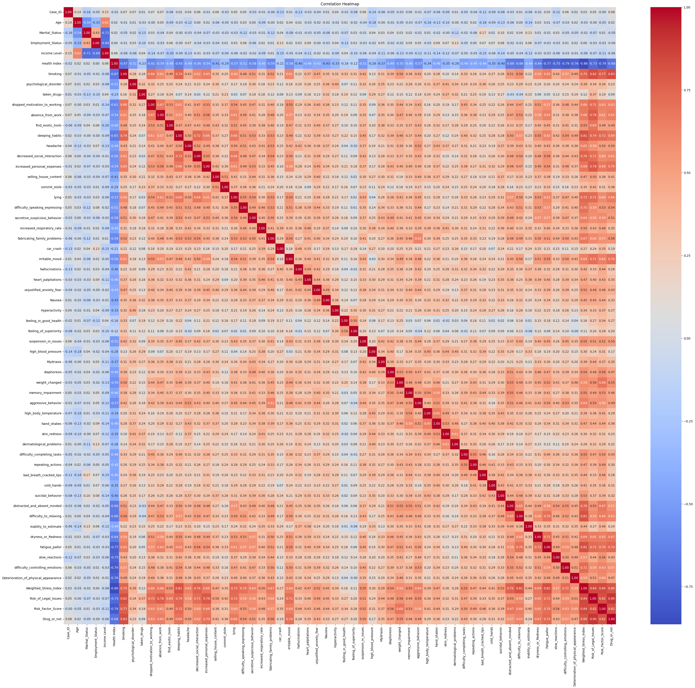
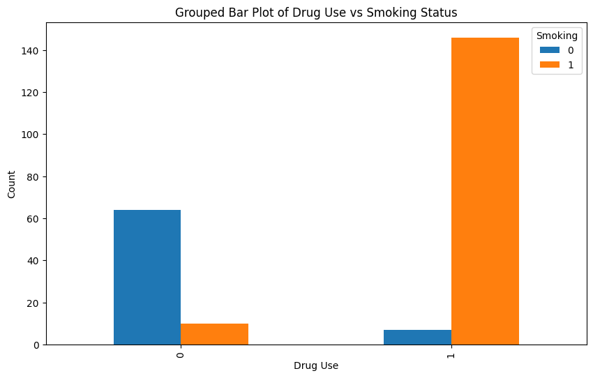
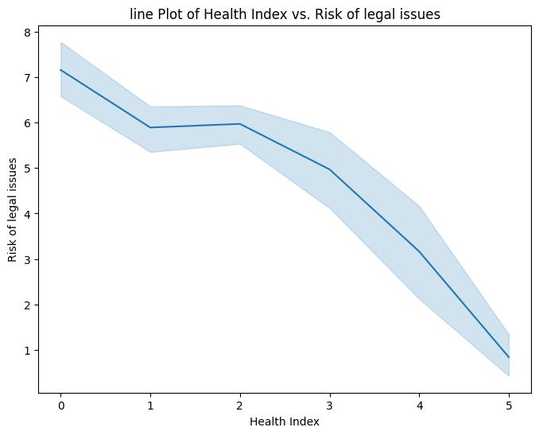

# Lifestyle & Behavioral Patterns Analysis Related to Drug Abuse

This repository contains an exploratory data analysis (EDA) project that examines lifestyle, behavioral, physical, and psychological indicators in relation to drug use. The work is implemented in a Jupyter notebook and supported by a presentation that communicates the results and interpretations.

## Table of Contents:

[Project Objectives](#Project-Objectives)

[Dataset](#Dataset)

[Methods & Workflow](#Methods-&-Workflow)

[Key Visualizations](#Key-Visualizations)

[Results](#Results)

[How to Run](#How-To-Run)

[Environment &amp; Dependencies](#Environment-&-Dependencies)

[Assumptions, Limitations &amp; Ethics](#Assumptions,-Limitations-&-Ethics)

[Author](#Author)

## Project Objectives

- **Explore** relationships between a wide set of lifestyle/behavioral indicators and drug use (Drug_or_not).
- **Describe** the data using frequency tables and descriptive statistics.
- **Visualize** patterns via bar charts, box plots, line plots, and a correlation heatmap.
- **Communicate** findings clearly (see the accompanying presentation in this repo).

## Dataset

- **File:** drug abuser.csv
- **Shape:** 227 rows × 60 columns
- **Target variable:** Drug_or_not with 153 “Yes” and 74 “No”
- **Key numeric features**:
  - Age (14–39)
  - Health Index (0–5)
  - Weighted_Stress_Index (~0–33.79)
  - Risk_of_Legal_Issues (0–9)
  - Risk_Factor_Score (~0–3.37)
- **Representative categorical/binary features** (subset):
  Smoking, psychological_disorder, sleeping_habits, decreased_social_interaction, increased_personal_expenses, dropped_motivation_to_working, absence_from_work, lying, irritable_mood, hallucinations, unjustified_anxiety_fear, Hyperactivity, memory_impairment, aggressive_behavior, suicidal_behavior, difficulty_controlling_emotions, Deterioration_of_physical_appearance, and many others.

> Note: The dataset is curated for academic/educational analysis. No personally identifying information is included.

## Methods & Workflow
The notebook Drug_Abuse_Analysis.ipynb follows this flow:

1) **Data Load & Light Preprocessing**

    - Imports pandas, numpy, seaborn, matplotlib.

    - Inspects missing values and duplicates.

    - Maps select binary fields ("Yes"/"No") to "1"/"0".

    - Label-encodes object (categorical) columns for the purpose of computing a correlation heatmap.

2) **Descriptive Statistics**

    - Measures of frequency (value counts).

    - Central tendency (mean, median, mode).

    - Dispersion (range, variance, standard deviation, IQR) for key numeric features.

3) **Univariate Visuals**

    - Bar charts and counts for important categorical/binary indicators.

4) **Bivariate Exploration**

    - Contingency tables (`pd.crosstab`): `Drug_or_not` vs. many behavioral/clinical indicators (e.g., `Smoking`, `psychological_disorder`, `sleeping_habits`, `decreased_social_interaction`, `increased_personal_expenses`), typically visualized as grouped bar charts.

    - Continuous–Continuous relations via line plots (e.g., `Weighted_Stress_Index` vs `Risk_of_Legal_Issues`; `Risk_Factor_Score` vs `Risk_of_Legal_Issues`).

    - Continuous–Binary relations via box plots split by Drug_or_not (e.g., `Weighted_Stress_Index`, `Risk_Factor_Score`, `Health Index`, `Risk_of_Legal_Issues`).

5) Correlation Heatmap

    - Label-encoded features are used to compute and display a Pearson correlation heatmap for an at-a-glance view of relationships.

## Key Visualizations
- Correlation heatmap (all features; Pearson on label-encoded columns).



- Grouped bar charts showing `Drug_or_not` vs selected binary features.



- Line plots (e.g., Stress/Legal risk; Risk factor/Legal risk; Legal risk/Weighted stress).



- Box plots of numeric features stratified by `Drug_or_not` (stress, risk factor, health, legal risk).


## Results
The analyses (both figures and contingency tables) consistently point to the following associations:

1) Smoking ↔ Drug use: Drug use is far more common among smokers than non-smokers.

2) Increased personal expenses: Strong association with drug use; “Yes” responses heavily concentrate within the drug-use group.

3) Psychological disorder: Elevated within the drug-use group.

4) Decreased social interaction & Sleep issues: Both tilt strongly toward the drug-use group.

5) Weighted Stress Index: Substantially higher among drug users (box plots); line plots suggest a positive link with `Risk_of_Legal_Issues`.

6) Risk Factor Score: Typically higher among drug users (often clustering around ~2), lower among non-users.

7) Health Index: On average lower for drug users and higher for non-users.

8) Risk of Legal Issues vs Health Index: Negative relationship—healthier individuals tend to show lower legal-risk scores.

9) Risk of Legal Issues vs Weighted Stress: Positive relationship—higher stress aligns with higher legal-risk. 

> Important: These are associations in observational data and should not be interpreted as causal effects.

> Note: these Observations are based on the output graphs available in the ipynb file.


## How to Run

1) Clone the Repo
```
git clone git clone https://github.com/Yousif-AlEshari/Lifestyle-Indicators-Drug-Use-Analysis.git
cd Lifestyle-Indicators-Drug-Use-Analysis
```

2) (Recommended) Create a Virtual Environment
```
python -m venv .venv
# Windows:
.venv\Scripts\activate
# macOS/Linux:
source .venv/bin/activate
```

3) Install Dependencies
```
pip install pandas numpy matplotlib seaborn scikit-learn jupyter
```

4) Launch Jupyter and run the analysis
```
jupyter notebook
```
> Open Drug_Abuse_Analysis.ipynb and run all cells

## Environment & Dependencies
- **Python** 3.8+ recommended
- **Core Libraries:** `pandas`, `numpy`, `matplotlib`, `seaborn`, `scikit-learn` (for `LabelEncoder`)

## Assumptions, Limitations & Ethics

- **Observational EDA, not causal inference:** 
    The project explores associations, not causes. Any policy or clinical implication should be treated as hypothesis-generating rather than definitive.

- **Encoded correlations:**
    The correlation heatmap uses label-encoded categorical variables; Pearson correlation on encoded categories can imply spurious “order”. Treat those coefficients as exploratory signals, not conclusive metrics.

- **Class balance:**
    `Drug_or_not` is imbalanced (153 “Yes”, 74 “No”). Visual comparisons should be interpreted with that in mind.

- **Ethical framing:**
    Findings should be used to guide supportive interventions (e.g., screening, counseling access, education) rather than punitive actions. Avoid stigmatization and ensure privacy and fairness in any downstream use.

## Author
#### Yousif Al Eshari
